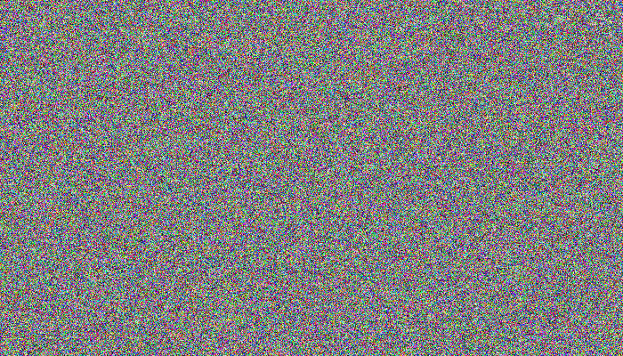

# Pixel Perfect Static

A simple sketch for Processing. Generates pixel-perfect animated color or b/w noise.

Princple of operation:
 
- Frame is generated pixel by pixel
      potato-style with random rgb values.
      (be patient). Each frame is then
      saved as a png file. When all frames
      are generated static starts playing
      at full speed.
 
- If all files already generated in the
      directory, program starts playing
      without generating.
 
- When changing display resolution
      delete \*.png files in the directory

